# Kontrybutowanie

Informacje o projekcie wraz ze specyfikacją są na [wiki](https://github.com/progzesp-gr2/projekt/wiki).

Zmiany w repozytorium są wprowadzane poprzez pull requesty.
Pull requesty muszą przejść automatyczne testy i zostać sprawdzone przed ich zmergowaniem.
Proces ten jest opisany poniżej.

## Pull Requesty

Do stworzenia pull requesta można wykonać poniższe kroki (lub patrz [GH Docs]):

### Stworzenie brancha

| Krok | `git` CLI | VS Code |
| ---- | --------- | ------- |
| **Stwórz nowy branch.** Dobrze by było nadać branchowi krótką nazwę związaną z planowanymi zmianami. Każdy taki branch będzie używany tylko do jednego PR. Nazwy nie powinne zawierać spacji ani znaków specjalnych. | `git checkout -b [nazwa brancha]` n.p. `git checkout -b example-branch` | Na dole po lewej, kliknij na przycisk z branchami 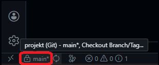  W popupie, kliknij *Create new branch...* 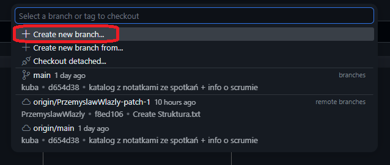  Wpisz nazwę brancha i kliknij <kbd>Enter</kbd> 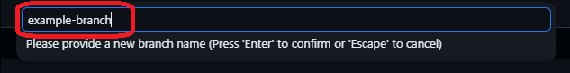 |
| **Sprawdź czy się udało.** | `git status` i patrz na *On branch ...* | Na dole po lewej, spójrz na przycisk z branchami 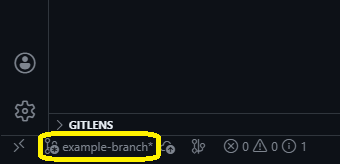 |
| **Dodaj zmienione pliki.** To jest też dobry czas na zrobienie własnego code review i sprawdzenie czy wszystko się zgadza. | `git add [nazwy plików]` n.p. `git add README.md` | Po lewej, w panelu *Source Control*, dodaj zmienione pliki przyciskiem `+` i wpisz nazwę commita 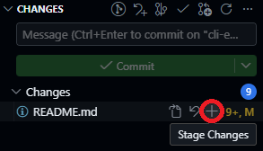  Klikając na nazwy plików możesz sprawdzić zmiany 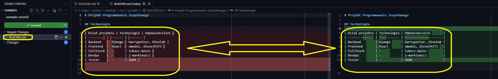 |
| **Zcommituj zmiany.** W pierwszej linii wiadomości krótko opisz zmiany (max. 80-120 znaków). Więcej informacji możesz wpisać (bez ograniczeń długości) po pustej linii. Krótki opis zmian powinien zawierać bardzo podstawowe informacje o zmianach (n.p. *"dodaj możliwość zmiany nazwy użytkownika"*). Kolejne linie wiadomości mogą zawierać więcej informacji (n.p. *"Użytkownicy mogą zmienić nazwę maksymalnie 2 razy co 30 dni. Zmiany można dokonać w ustawieniach konta, które wywołuje PATCH na endpoincie `api/users/{id}`."*), ale takie informacje powinny (również) znaleźć się w opisie pull requesta (patrz niżej). Można tu stosować *podstawowe* **formatowanie** `markdownowe`. | `git commit -m "[wiadomość commita]"` n.p. `git commit -m "example commit"` | Po lewej, w panelu *Source Control*, kliknij *Commit* 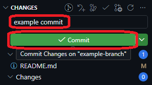 |
| **Opublikuj branch.** | `git push -u [nazwa upstreamu] [nazwa brancha]` n.p. `git push -u origin example-branch` | Po lewej, w panelu *Source Control*, kliknij *Publish Branch* 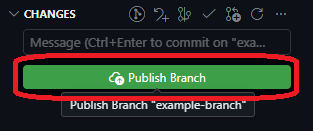 |

### Stworzenie pull requesta

| Krok | Opis | Screenshot |
| ---- | ---- | ---------- |
| **Zacznij otwierać pull request.** | Na stronie repozytorium, w tabie *Pull requests*, kliknij *New pull request* albo *Compare & pull request*. | 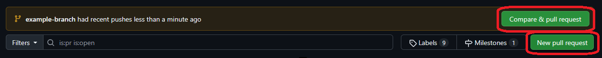 |
| **Stwórz pull request.** | Sprawdź branche pull requesta i go stwórz. Zazwyczaj pull requesty będą otwierane na branch *main* (*base*, po lewej) z branchu, który przed chwilą został stworzony (*compare*, po prawej). | 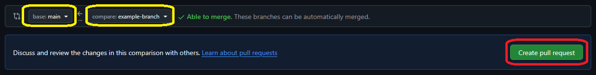 |
| **Uzupełnij informacje.** Tytuł powinien zawierać (bardzo) krótki opis zmian, opis powinien zawierać wszystkie informacje potrzebne do zrozumienia zmian przez reviewera (im więcej tym zwykle lepiej, ale niepotrzebnych lub zbyt długo napisanych informacji nie powinno być - lista zmienionych plików, kopie zmienionych części kodu, itp. nie są pomocne). | Wpisz tytuł i opis pull requesta i opcjonalnie (po prawej): poproś konkretne osoby o review, dodaj osoby jako zassignowane, dodaj labele, i/lub dodaj PR do projektu. W opisie możesz użyć *closing keywords* (n.p. *"Closes #11"*) aby po zmergowaniu pull requesta automatycznie zamknąć wzmienione issuey.  Po wypełnieniu wszystkich informacji, kliknij *Create pull request*. | 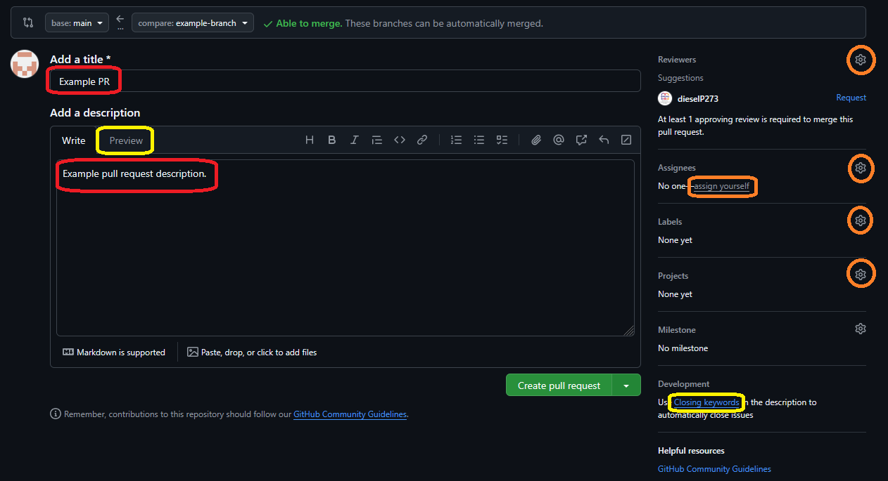  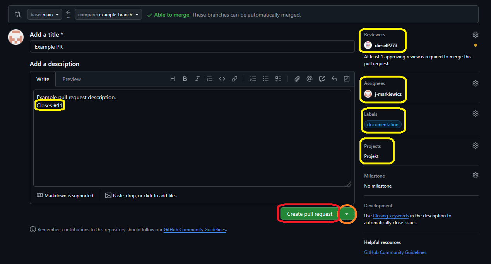 |
| **Opiekuj się zmianami.** | Poczekaj na zakończenie CI (aż pokaże się *All checks have passed*) - gdyby coś poszło nie tak to napraw dodając commita do brancha i pushując, commit wtedy automatycznie się doda do otwartego PR. Poczekaj na review i **odpowiadaj na ewentualne komentarze/prośby o zmiany** (aż pokaże się *Changes approved*). Jeśli uważasz, że zmiany są dobre i **na pewno** zostaną zaakceptowane **bez komentarzy**, możesz włączyć automatyczne mergowanie - wtedy po spełnieniu wszystkich warunków PR zostanie zmergowany automatycznie. Jeśli PR jeszcze nie jest gotowy do review, możesz go oznaczyć jako draft. **Oczekuje się, że większość PRów przejdzie przez kilka cykli review+zmian.** | 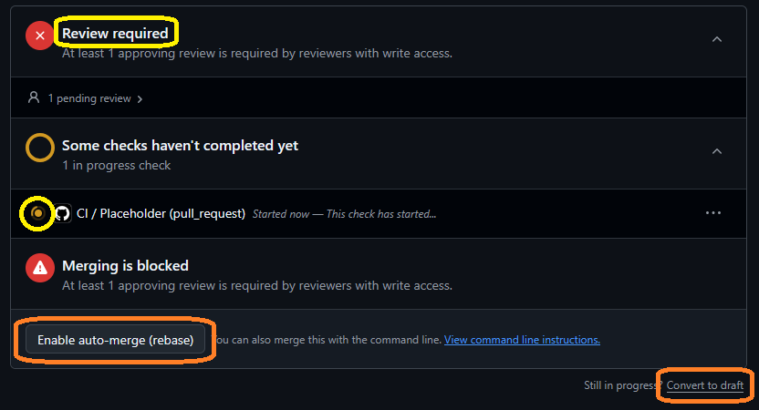 |
| **Zmerguj.** | Po spełnieniu wszystkich wyżej wymienionych warunków, PR jest gotowy do zmergowania. O ile nie ma konfliktu, kliknij *Rebase and merge*. Jeśli istniałyby konflikty uniemożliwiające mergowanie, napraw je i wróć do poprzedniego kroku. Pamiętaj o zpullowaniu zmian i stworzeniu nowego brancha przed rozpoczęciem dalszej pracy. | 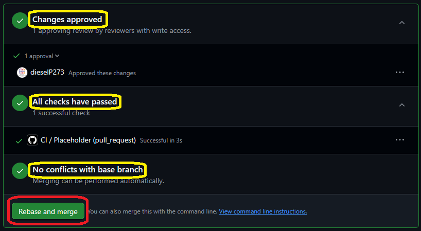 |

### Reviewowanie pull requesta

Na stronie z pull requestem (`https://github.com/progzesp-gr2/projekt/pull/[id]`), można stworzyć review.

| Krok | Opis | Screenshot |
| ---- | ---- | ---------- |
| **Sprawdź zmiany.** | Otwórz tab *Files changed* i sprawdź zmienione pliki. Na górze po lewej możesz wybrać commity, których zmiany mają być pokazane. Podczas przeglądania zmian, możesz dodać komentarze na poziomie pliku, jednej lub kilku linii, lub całego pull requesta. Po sprawdzeniu danego pliku, możesz oznaczyć go jako *Viewed*, co oznaczy plik jako sprawdzony dla twojej informacji. Po sprawdzeniu wszystkich zmian, kliknij na *Submit review*. | 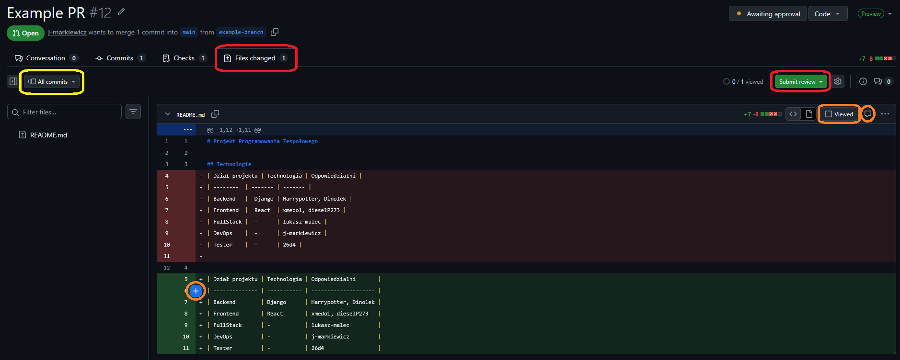 |
| **Odpowiedz na PR.** | W popupie, który się otworzy po kliknięciu *Submit review*, możesz wpisać komentarz podsumowujący cały review, oraz wybrać czy twój review jest: **komentarzem** (który może zawierać ogólne uwagi, propozycje zmian, itp. bez pozwolenia na mergowanie), **zatwierdzeniem** (które umożliwi mergowanie i może opcjonalnie zawierać propozycje opcjonalnych zmian lub inne komentarze - powinno być zaznaczone **tylko** po sprawdzeniu **wszystkich** zmian), czy **prośbą o zmiany** (które poprosi autora o zatwierdzenie zmian lub o odpowiedź na prośbę bez pozwolenia na mergowanie). | 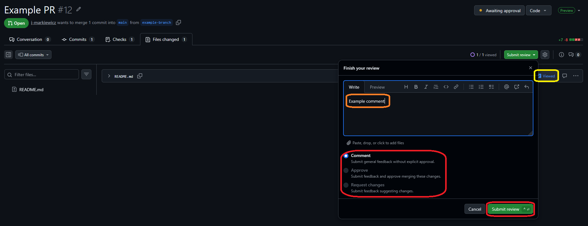 |

Komentarze pojawią się jako dyskusje na stronie pull requesta i mogą zostać zamknięte przez ich autora przy użyciu przycisku *Resolve conversation*.
Pull requesty nie powinne być mergowane jeśli mają otwarte dyskusje odnoszące się do zawartości danego PRu (a nie n.p. propozycje późniejszych zmian, które nie będą wprowadzane w danym PR itp.).

**Oczekuje się, że większość PRów przejdzie przez kilka cykli review+zmian.**

Przed zmergowaniem pull requesta, osoby z wybranych teamów odpowiedzalnych za zmienione pliki muszą stworzyć review zatwierdzający zmiany (minimum dwa approvalsy w sumie, plus poniższe minima teamowe, nie licząc osoby tworzącej PR).

| Team      | Minimum zatwierdzeń | Odpowiedzialne pliki         | Członkowie                                                                    |
| --------- | ------------------- | ---------------------------- | ----------------------------------------------------------------------------- |
| Admin     | 0\*                 | `README.md`, `/scrum/`, itp. | Kuba (@dieselP273)                                                            |
| Backend   | 1                   | `/backend/`                  | Aleksander (@Dinolek), Łukasz (@lukasz-malec), Przemysław (@PrzemyslawWlazly) |
| DevOps    | 0\*                 | `.github/`                   | Jan (@j-markiewicz)                                                           |
| Frontend  | 1                   | `/frontend/`                 | Nikodem (@xmedo1), Łukasz (@lukasz-malec), Kuba (@dieselP273)                 |
| Reviewers | 1                   | wszystkie                    | Jan (@j-markiewicz), Kuba (@dieselP273)                                       |
| Testers   | 0\*                 | automatyczne testy           | Witold (@26d4)                                                                |

\* Te zespoły mają tylko po jednej osobie, więc aby umożliwić mergowanie PRów stworzonym przez ich członków, wymaganie jest ustawione na 0. Jeśli pliki, za które te zespoły są odpowiedzialne są modyfikowane w PRach niestworzonych przez ich członków, proszę traktować te approvalsy jako wymagane.

[GH Docs]: https://docs.github.com/en/pull-requests/collaborating-with-pull-requests/proposing-changes-to-your-work-with-pull-requests/creating-a-pull-request
